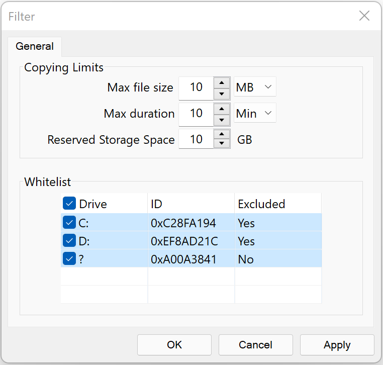

# Disk Spy

This Win32 app is designed to deploy on a computer to steal data from connected physical storage devices.

Data from other drives can be copied either manually or automatically, and is stored in the drive where this app is located in. Automatic mode is enabled when this app is running in background.

Additionally, there is also a filter, which can be configured in the file "Filter.ini" that should be in this app's directory.

```
[Copy Limits] # Section

MaxFileSize # Key: int
# If set, any file whose size is greater than the value is ignored
# Valid range: 0~9999 (0=Disabled)

FileUnit # Key: enum
# Valid values: 0=KB, 1=MB, 2=GB

MaxDuration # Key: int
# If set, copying stops when the duration is reached
# Valid range: 0~9999; 0=Disabled

TimeUnit # Key: enum
# Valid values: 0=Sec, 1=Min

ReservedStorageSpaceGB # Key: int
# If set, copying stops when the free space of the drive where this app is located in is less than the value

---

[Whitelist] # Section

(DriveID,Excluded)[64]) # Key: list(hex,bool)[64]
# If set, corresponding drives are excluded in automatic mode
# Valid values: 'DriveID': 0xXXXXXXXX; 'Excluded': 0=false, 1=true
# Each pair should be separated by ';', e.g., 0x1234,0;0x5678,1;

SpecialFileName # Key: string(8)
# If set, drives are excluded in automatic mode when such a file exists in the root
```


